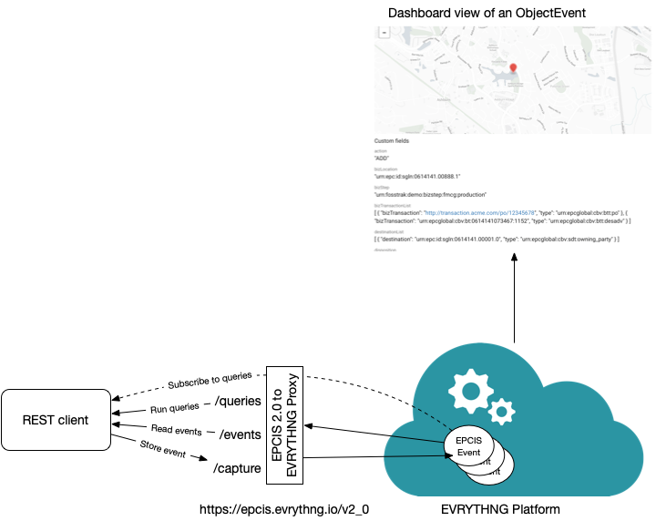

# EPCIS 2.0 Proxy Implementation for EVRYTHNG

A proxy to use the upcoming EPCIS 2.0 standard with the EVRYTHNG API. EPCIS 2.0 is the latest update of the GS1 EPCIS standard and is currently being developed by the EPCIS and CBV 2.0 MSWG. The standard has not been ratified yet, hence consider everything you see here tentative.


## Overview of the EPCIS 2.0 Proxy



This proxy is a (partial) implementation of the [EPCIS 2.0 bindings](https://github.com/evrythng/gs1-epcis-2.0) as a proxy for the EVRYTHNG platform. Currently supported are the `/capture` and `/events` endpoints. `/capture` is to store events, `/events` is to access events individually or entire event collections. The `/queries` endpoint will allow clients to run complex queries and to subscribe to queries to receive real-time updates when new events emerge that meet the query constraints. If you have an [EVRYTHNG account](https://dashboard.evrythng.com), you can view events as Actions.
 
## Setup

### Requirements:

- Node version > 8.0
- Serverless version >= 1.36.3
- evrythng-extended version >= 4.7.2
- [EVRYTHNG](https://dashboard.evrythng.com) account
- [Trusted App API](https://developers.evrythng.com/docs/api-key-scopes-and-permissions#section-trusted-application-api-key)
- Create two [custom Action types](https://developers.evrythng.com/reference/action-types): `_ObjectEvent`, `_AggregationEvent` 

### Installation:

- Make sure serverless is installed globally `npm install serverless -g`
- If you're deploying the gateway for the first time, [follow these instructions](https://serverless.com).
- Install evrythng-exgtended `npm i -s evrythng-extended`
- Deploy the new gateway `serverless deploy`
- Debugging information can be obtained by inspecting log files. For example, to read the latest log files for the capture interface, type `serverless logs -f capture`

### Project structure:

- [evrythng-proxy](evrythng-proxy) contains the EPCIS 2.0 proxy, that will be deployed on AWS
- An account on the [EVRYTHNG platform](https://dashboard.evrythng.com), which serves as backend. **If you don't provide an API key, you'll use the default public EPCIS 2.0 account on EVRYTHNG**. 

## Some examples

 You can either use the default account or create our own account and project. If you don't specify an API key, you'll automatically interact with the default account. If you want to create setup your own environment, you'll need an [EVRYTHNG](https://dashboard.evrythng.com) account, create a project and within that project, create an Application to obtain a [Trusted App API](https://developers.evrythng.com/docs/api-key-scopes-and-permissions#section-trusted-application-api-key). When you use the service, include the Trusted App API key in the header `Authorization:O5yOC...7aEOwMa3o`.  


### Capturing EPCIS Events

Danny Haak developed a handy [EPCIS 2.0 XML to JSON converter](https://mimasu.nl/epcis/xmljson).  To create your first ObjectEvent, take for instance the first example from [https://mimasu.nl/epcis/xmljson](https://mimasu.nl/epcis/xmljson) and try:

**Request**

```bash
curl -X POST "https://epcis.evrythng.io/v2_0/capture" -H "Content-Type: application/json" -d "@-" <<EOF
{
  "@context": "https://id.gs1.org/epcis-context.jsonld",
  "isA": "EPCISDocument",
  "creationDate": "2005-07-11T11:30:47+00:00",
  "schemaVersion": 1.2,
  "format": "application/ld+json",
  "epcisBody": {
    "eventList": [
      {
        "isA": "ObjectEvent",
        "eventTime": "2005-04-03T20:33:31.116-06:00",
        "eventTimeZoneOffset": "-06:00",
        "epcList": [
          "urn:epc:id:sgtin:0614141.107346.2017",
          "urn:epc:id:sgtin:0614141.107346.2018"
        ],
        "action": "OBSERVE",
        "bizStep": "urn:epcglobal:cbv:bizstep:shipping",
        "disposition": "urn:epcglobal:cbv:disp:in_transit",
        "readPoint": "urn:epc:id:sgln:0614141.07346.1234",
        "bizTransactionList": [
          {
            "type": "urn:epcglobal:cbv:btt:po",
            "bizTransaction": "http://transaction.acme.com/po/12345678"
          }
        ]
      },
      {
        "isA": "ObjectEvent",
        "eventTime": "2005-04-04T20:33:31.116-06:00",
        "eventTimeZoneOffset": "-06:00",
        "epcList": [
          "urn:epc:id:sgtin:0614141.107346.2018"
        ],
        "action": "OBSERVE",
        "bizStep": "urn:epcglobal:cbv:bizstep:receiving",
        "disposition": "urn:epcglobal:cbv:disp:in_progress",
        "readPoint": "urn:epc:id:sgln:0012345.11111.400",
        "bizLocation": "urn:epc:id:sgln:0012345.11111.0",
        "bizTransactionList": [
          {
            "type": "urn:epcglobal:cbv:btt:po",
            "bizTransaction": "http://transaction.acme.com/po/12345678"
          },
          {
            "type": "urn:epcglobal:cbv:btt:desadv",
            "bizTransaction": "urn:epcglobal:cbv:bt:0614141073467:1152"
          }
        ],
        "example:myField": {
          "@xmlns:example": "http://ns.example.com/epcis",
          "#text": "Example of a vendor/user extension"
        }
      }
    ]
  }
}
EOF
```

**Response**

```python
[{"action":"OBSERVE","bizStep":"urn:epcglobal:cbv:bizstep:shipping","bizTransactionList":[{"bizTransaction":"http://transaction.acme.com/po/12345678","type":"urn:epcglobal:cbv:btt:po"}],"disposition":"urn:epcglobal:cbv:disp:in_transit","epcList":["urn:epc:id:sgtin:0614141.107346.2017","urn:epc:id:sgtin:0614141.107346.2018"],"eventTime":"2005-04-03T20:33:31.116-06:00","eventTimeZoneOffset":"-06:00","isA":"ObjectEvent","readPoint":"urn:epc:id:sgln:0614141.07346.1234"},{"action":"OBSERVE","bizLocation":"urn:epc:id:sgln:0012345.11111.0","bizStep":"urn:epcglobal:cbv:bizstep:receiving","bizTransactionList":[{"bizTransaction":"http://transaction.acme.com/po/12345678","type":"urn:epcglobal:cbv:btt:po"},{"bizTransaction":"urn:epcglobal:cbv:bt:0614141073467:1152","type":"urn:epcglobal:cbv:btt:desadv"}],"disposition":"urn:epcglobal:cbv:disp:in_progress","epcList":["urn:epc:id:sgtin:0614141.107346.2018"],"eventTime":"2005-04-04T20:33:31.116-06:00","eventTimeZoneOffset":"-06:00","example:myField":{"#text":"Example of a vendor/user extension","@xmlns:example":"http://ns.example.com/epcis"},"isA":"ObjectEvent","readPoint":"urn:epc:id:sgln:0012345.11111.400"}]
```

### Return events of any type

Try this link to get a list of [all events](https://epcis.evrythng.io/v2_0/events/all) from your browser. With curl:

**Request**

 curl https://epcis.evrythng.io/v2_0/events/all -H "Content-Type: application/json"

**Response**

```python
[{"action":"OBSERVE","bizLocation":"urn:epc:id:sgln:0614141.00888.0","bizStep":"urn:epcglobal:cbv:bizstep:receiving","childEPCs":["urn:epc:id:sgtin:0614141.107346.2017","urn:epc:id:sgtin:0614141.107346.2018"],"childQuantityList":[{"epcClass":"urn:epc:idpat:sgtin:4012345.098765.*","quantity":"10"},{"epcClass":"urn:epc:class:lgtin:4012345.012345.998877","quantity":"200.5","uom":"KGM"}],"disposition":"urn:epcglobal:cbv:disp:in_progress","eventTime":"2013-06-08T14:58:56.591Z","eventTimeZoneOffset":"+02:00","example:myField":"Example of a vendor/user extension","id":"_:event3","isA":"AggregationEvent","parentID":"urn:epc:id:sscc:0614141.1234567890","readPoint":"urn:epc:id:sgln:0614141.00777.0"}]

```
...


### Return all object events

Try this link to get a list of [ObjectEvents](https://epcis.evrythng.io/v2_0/events/ObjectEvent) from your browser. With curl:
**Request**

```bash
 curl https://epcis.evrythng.io/v2_0/events/ObjectEvent -H "Content-Type: application/json"
```

**Response**

```json
[{"action":"ADD","bizLocation":"urn:epc:id:sgln:0614141.00888.1","bizStep":"urn:fosstrak:demo:bizstep:fmcg:production","bizTransactionList":[{"bizTransaction":"http://transaction.acme.com/po/12345678","type":"urn:epcglobal:cbv:btt:po"},{"bizTransaction":"urn:epcglobal:cbv:bt:0614141073467:1152","type":"urn:epcglobal:cbv:btt:desadv"}],"destinationList":[{"destination":"urn:epc:id:sgln:0614141.00001.0","type":"urn:epcglobal:cbv:sdt:owning_party"}],"disposition":"urn:fosstrak:demo:disp:fmcg:pendingQA","epcList":["urn:epc:id:sgtin:0614141.107346.2011","urn:epc:id:sgtin:0614141.107346.2012"],"eventID":"_:event1","eventTime":"2008-11-09T13:30:17Z","eventTimeZoneOffset":"+00:00","isA":"ObjectEvent","readPoint":"urn:epc:id:sgln:0614141.00777.0","sourceList":[{"source":"urn:epc:id:sgln:4012345.00001.0","type":"urn:epcglobal:cbv:sdt:possessing_party"}]},{"action":"ADD","bizLocation":"urn:epc:id:sgln:0614141.00888.0","bizStep":"urn:fosstrak:demo:bizstep:fmcg:production","bizTransactionList":[{"bizTransaction":"http://transaction.acme.com/po/12345678","type":"urn:epcglobal:cbv:btt:po"},{"bizTransaction":"urn:epcglobal:cbv:bt:0614141073467:1152","type":"urn:epcglobal:cbv:btt:desadv"}],"destinationList":[{"destination":"urn:epc:id:sgln:0614141.00001.0","type":"urn:epcglobal:cbv:sdt:owning_party"}],"disposition":"urn:fosstrak:demo:disp:fmcg:pendingQA","epcList":["urn:epc:id:sgtin:0614141.107346.2017","urn:epc:id:sgtin:0614141.107346.2018"],"eventID":"_:event2","eventTime":"2008-11-09T13:30:17Z","eventTimeZoneOffset":"+00:00","isA":"ObjectEvent","readPoint":"urn:epc:id:sgln:0614141.00777.0","sourceList":[{"source":"urn:epc:id:sgln:4012345.00001.0","type":"urn:epcglobal:cbv:sdt:possessing_party"}]}]
```

### Show me the ObjectEvent `_:event1`

Try this link to access [`_:event1`](https://epcis.evrythng.io/v2_0/events/ObjectEvent/_:event1) from your browser. With curl:

**Request**

```bash
 curl https://epcis.evrythng.io/v2_0/events/ObjectEvent/_:event1 -H "Content-Type: application/json"
 ```
 
 ```json
 [{"action":"ADD","bizLocation":"urn:epc:id:sgln:0614141.00888.1","bizStep":"urn:fosstrak:demo:bizstep:fmcg:production","bizTransactionList":[{"bizTransaction":"http://transaction.acme.com/po/12345678","type":"urn:epcglobal:cbv:btt:po"},{"bizTransaction":"urn:epcglobal:cbv:bt:0614141073467:1152","type":"urn:epcglobal:cbv:btt:desadv"}],"destinationList":[{"destination":"urn:epc:id:sgln:0614141.00001.0","type":"urn:epcglobal:cbv:sdt:owning_party"}],"disposition":"urn:fosstrak:demo:disp:fmcg:pendingQA","epcList":["urn:epc:id:sgtin:0614141.107346.2011","urn:epc:id:sgtin:0614141.107346.2012"],"eventID":"_:event1","eventTime":"2008-11-09T13:30:17Z","eventTimeZoneOffset":"+00:00","isA":"ObjectEvent","readPoint":"urn:epc:id:sgln:0614141.00777.0","sourceList":[{"source":"urn:epc:id:sgln:4012345.00001.0","type":"urn:epcglobal:cbv:sdt:possessing_party"}]}]
```
### Use filters to narrow down the collection of returned events

List events that are either [Aggregation or Object Events and that occurred at the business location `urn:epc:id:sgln:0614141.00888.0`](https://epcis.evrythng.io/v2_0/events/all?$filter=eventType+in+(ObjectEvent,AggregationEvent)&bizLocation+eq+urn:epc:id:sgln:0614141.00888.0)

**Request**

```bash
curl -X GET "https://epcis.evrythng.io/v2_0/events/all?$filter=eventType+in+(ObjectEvent,AggregationEvent)&bizLocation+eq+urn:epc:id:sgln:0614141.00888.0" -H "Content-Type: application/json"
``` 

**Response**

```json
[{"action":"OBSERVE","bizLocation":"urn:epc:id:sgln:0614141.00888.0","bizStep":"urn:epcglobal:cbv:bizstep:receiving","childEPCs":["urn:epc:id:sgtin:0614141.107346.2017","urn:epc:id:sgtin:0614141.107346.2018"],"childQuantityList":[{"epcClass":"urn:epc:idpat:sgtin:4012345.098765.*","quantity":"10"},{"epcClass":"urn:epc:class:lgtin:4012345.012345.998877","quantity":"200.5","uom":"KGM"}],"disposition":"urn:epcglobal:cbv:disp:in_progress","eventTime":"2013-06-08T14:58:56.591Z","eventTimeZoneOffset":"+02:00","example:myField":"Example of a vendor/user extension","id":"_:event3","isA":"AggregationEvent","parentID":"urn:epc:id:sscc:0614141.1234567890","readPoint":"urn:epc:id:sgln:0614141.00777.0"},{"action":"OBSERVE","bizLocation":"urn:epc:id:sgln:0614141.00888.0","bizStep":"urn:epcglobal:cbv:bizstep:receiving","childEPCs":["urn:epc:id:sgtin:0614141.107346.2017","urn:epc:id:sgtin:0614141.107346.2018"],"childQuantityList":[{"epcClass":"urn:epc:idpat:sgtin:4012345.098765.*","quantity":"10"},{"epcClass":"urn:epc:class:lgtin:4012345.012345.998877","quantity":"200.5","uom":"KGM"}],"disposition":"urn:epcglobal:cbv:disp:in_progress","eventTime":"2013-06-08T14:58:56.591Z","eventTimeZoneOffset":"+02:00","example:myField":"Example of a vendor/user extension","id":"_:event3","isA":"AggregationEvent","parentID":"urn:epc:id:sscc:0614141.1234567890","readPoint":"urn:epc:id:sgln:0614141.00777.0"},{"action":"OBSERVE","bizLocation":"urn:epc:id:sgln:0614141.00888.0","bizStep":"urn:epcglobal:cbv:bizstep:receiving","childEPCs":["urn:epc:id:sgtin:0614141.107346.2017","urn:epc:id:sgtin:0614141.107346.2018"],"childQuantityList":[{"epcClass":"urn:epc:idpat:sgtin:4012345.098765.*","quantity":"10"},{"epcClass":"urn:epc:class:lgtin:4012345.012345.998877","quantity":"200.5","uom":"KGM"}],"disposition":"urn:epcglobal:cbv:disp:in_progress","eventTime":"2013-06-08T14:58:56.591Z","eventTimeZoneOffset":"+02:00","example:myField":"Example of a vendor/user extension","id":"_:event3","isA":"AggregationEvent","parentID":"urn:epc:id:sscc:0614141.1234567890","readPoint":"urn:epc:id:sgln:0614141.00777.0"},{"action":"OBSERVE","bizLocation":"urn:epc:id:sgln:0614141.00888.0","bizStep":"urn:epcglobal:cbv:bizstep:receiving","childEPCs":["urn:epc:id:sgtin:0614141.107346.2017","urn:epc:id:sgtin:0614141.107346.2018"],"childQuantityList":[{"epcClass":"urn:epc:idpat:sgtin:4012345.098765.*","quantity":"10"},{"epcClass":"urn:epc:class:lgtin:4012345.012345.998877","quantity":"200.5","uom":"KGM"}],"disposition":"urn:epcglobal:cbv:disp:in_progress","eventTime":"2013-06-08T14:58:56.591Z","eventTimeZoneOffset":"+02:00","example:myField":"Example of a vendor/user extension","id":"_:event3","isA":"AggregationEvent","parentID":"urn:epc:id:sscc:0614141.1234567890","readPoint":"urn:epc:id:sgln:0614141.00777.0"},{"action":"OBSERVE","bizLocation":"urn:epc:id:sgln:0614141.00888.0","bizStep":"urn:epcglobal:cbv:bizstep:receiving","childEPCs":["urn:epc:id:sgtin:0614141.107346.2017","urn:epc:id:sgtin:0614141.107346.2018"],"childQuantityList":[{"epcClass":"urn:epc:idpat:sgtin:4012345.098765.*","quantity":10},{"epcClass":"urn:epc:class:lgtin:4012345.012345.998877","quantity":200.5,"uom":"KGM"}],"disposition":"urn:epcglobal:cbv:disp:in_progress","eventTime":"2013-06-08T14:58:56.591+00:00","eventTimeZoneOffset":"+02:00","example:myField":{"#text":"Example of a vendor/user extension","@xmlns:example":"http://ns.example.com/epcis"},"isA":"AggregationEvent","parentID":"urn:epc:id:sscc:0614141.1234567890","readPoint":"urn:epc:id:sgln:0614141.00777.0"},{"action":"OBSERVE","bizLocation":"urn:epc:id:sgln:0614141.00888.0","bizStep":"urn:epcglobal:cbv:bizstep:receiving","childEPCs":["urn:epc:id:sgtin:0614141.107346.2017","urn:epc:id:sgtin:0614141.107346.2018"],"childQuantityList":[{"epcClass":"urn:epc:idpat:sgtin:4012345.098765.*","quantity":"10"},{"epcClass":"urn:epc:class:lgtin:4012345.012345.998877","quantity":"200.5","uom":"KGM"}],"disposition":"urn:epcglobal:cbv:disp:in_progress","eventTime":"2013-06-08T14:58:56.591Z","eventTimeZoneOffset":"+02:00","example:myField":"Example of a vendor/user extension","id":"_:event3","isA":"AggregationEvent","parentID":"urn:epc:id:sscc:0614141.1234567890","readPoint":"urn:epc:id:sgln:0614141.00777.0"},{"action":"OBSERVE","bizLocation":"urn:epc:id:sgln:0614141.00888.0","bizStep":"urn:epcglobal:cbv:bizstep:receiving","childEPCs":["urn:epc:id:sgtin:0614141.107346.2017","urn:epc:id:sgtin:0614141.107346.2018"],"childQuantityList":[{"epcClass":"urn:epc:idpat:sgtin:4012345.098765.*","quantity":"10"},{"epcClass":"urn:epc:class:lgtin:4012345.012345.998877","quantity":"200.5","uom":"KGM"}],"disposition":"urn:epcglobal:cbv:disp:in_progress","eventTime":"2013-06-08T14:58:56.591Z","eventTimeZoneOffset":"+02:00","example:myField":"Example of a vendor/user extension","id":"_:event3","isA":"AggregationEvent","parentID":"urn:epc:id:sscc:0614141.1234567890","readPoint":"urn:epc:id:sgln:0614141.00777.0"},{"action":"OBSERVE","bizLocation":"urn:epc:id:sgln:0614141.00888.0","bizStep":"urn:epcglobal:cbv:bizstep:receiving","childEPCs":["urn:epc:id:sgtin:0614141.107346.2017","urn:epc:id:sgtin:0614141.107346.2018"],"childQuantityList":[{"epcClass":"urn:epc:idpat:sgtin:4012345.098765.*","quantity":"10"},{"epcClass":"urn:epc:class:lgtin:4012345.012345.998877","quantity":"200.5","uom":"KGM"}],"disposition":"urn:epcglobal:cbv:disp:in_progress","eventTime":"2013-06-08T14:58:56.591Z","eventTimeZoneOffset":"+02:00","example:myField":"Example of a vendor/user extension","id":"_:event3","isA":"AggregationEvent","parentID":"urn:epc:id:sscc:0614141.1234567890","readPoint":"urn:epc:id:sgln:0614141.00777.0"},{"action":"OBSERVE","bizLocation":"urn:epc:id:sgln:0614141.00888.0","bizStep":"urn:epcglobal:cbv:bizstep:receiving","childEPCs":["urn:epc:id:sgtin:0614141.107346.2017","urn:epc:id:sgtin:0614141.107346.2018"],"childQuantityList":[{"epcClass":"urn:epc:idpat:sgtin:4012345.098765.*","quantity":"10"},{"epcClass":"urn:epc:class:lgtin:4012345.012345.998877","quantity":"200.5","uom":"KGM"}],"disposition":"urn:epcglobal:cbv:disp:in_progress","eventTime":"2013-06-08T14:58:56.591Z","eventTimeZoneOffset":"+02:00","example:myField":"Example of a vendor/user extension","id":"_:event3","isA":"AggregationEvent","parentID":"urn:epc:id:sscc:0614141.1234567890","readPoint":"urn:epc:id:sgln:0614141.00777.0"},{"action":"OBSERVE","bizLocation":"urn:epc:id:sgln:0614141.00888.0","bizStep":"urn:epcglobal:cbv:bizstep:receiving","childEPCs":["urn:epc:id:sgtin:0614141.107346.2017","urn:epc:id:sgtin:0614141.107346.2018"],"childQuantityList":[{"epcClass":"urn:epc:idpat:sgtin:4012345.098765.*","quantity":"10"},{"epcClass":"urn:epc:class:lgtin:4012345.012345.998877","quantity":"200.5","uom":"KGM"}],"disposition":"urn:epcglobal:cbv:disp:in_progress","eventTime":"2013-06-08T14:58:56.591Z","eventTimeZoneOffset":"+02:00","example:myField":"Example of a vendor/user extension","id":"_:event3","isA":"AggregationEvent","parentID":"urn:epc:id:sscc:0614141.1234567890","readPoint":"urn:epc:id:sgln:0614141.00777.0"},{"action":"ADD","bizLocation":"urn:epc:id:sgln:0614141.00888.1","bizStep":"urn:fosstrak:demo:bizstep:fmcg:production","bizTransactionList":[{"bizTransaction":"http://transaction.acme.com/po/12345678","type":"urn:epcglobal:cbv:btt:po"},{"bizTransaction":"urn:epcglobal:cbv:bt:0614141073467:1152","type":"urn:epcglobal:cbv:btt:desadv"}],"destinationList":[{"destination":"urn:epc:id:sgln:0614141.00001.0","type":"urn:epcglobal:cbv:sdt:owning_party"}],"disposition":"urn:fosstrak:demo:disp:fmcg:pendingQA","epcList":["urn:epc:id:sgtin:0614141.107346.2011","urn:epc:id:sgtin:0614141.107346.2012"],"eventID":"_:event1","eventTime":"2008-11-09T13:30:17Z","eventTimeZoneOffset":"+00:00","isA":"ObjectEvent","readPoint":"urn:epc:id:sgln:0614141.00777.0","sourceList":[{"source":"urn:epc:id:sgln:4012345.00001.0","type":"urn:epcglobal:cbv:sdt:possessing_party"}]},{"action":"ADD","bizLocation":"urn:epc:id:sgln:0614141.00888.0","bizStep":"urn:fosstrak:demo:bizstep:fmcg:production","bizTransactionList":[{"bizTransaction":"http://transaction.acme.com/po/12345678","type":"urn:epcglobal:cbv:btt:po"},{"bizTransaction":"urn:epcglobal:cbv:bt:0614141073467:1152","type":"urn:epcglobal:cbv:btt:desadv"}],"destinationList":[{"destination":"urn:epc:id:sgln:0614141.00001.0","type":"urn:epcglobal:cbv:sdt:owning_party"}],"disposition":"urn:fosstrak:demo:disp:fmcg:pendingQA","epcList":["urn:epc:id:sgtin:0614141.107346.2017","urn:epc:id:sgtin:0614141.107346.2018"],"eventID":"_:event2","eventTime":"2008-11-09T13:30:17Z","eventTimeZoneOffset":"+00:00","isA":"ObjectEvent","readPoint":"urn:epc:id:sgln:0614141.00777.0","sourceList":[{"source":"urn:epc:id:sgln:4012345.00001.0","type":"urn:epcglobal:cbv:sdt:possessing_party"}]}]
```

## Related projects

- REST API:
    - [EPCIS 2.0 bindings](https://github.com/evrythng/gs1-epcis-2.0)
- Payload specifications: 
    - [EPCIS 2.0 JSON Schema](https://github.com/dannyhaak/epcis2-json-schema)
    - [EPCIS XML to JSON](https://mimasu.nl/epcis/xmljson)
    - [EPCIS 2.0 JSON-LD]() 